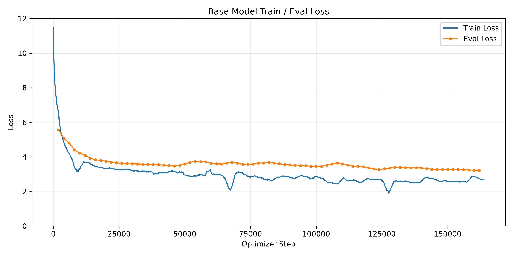
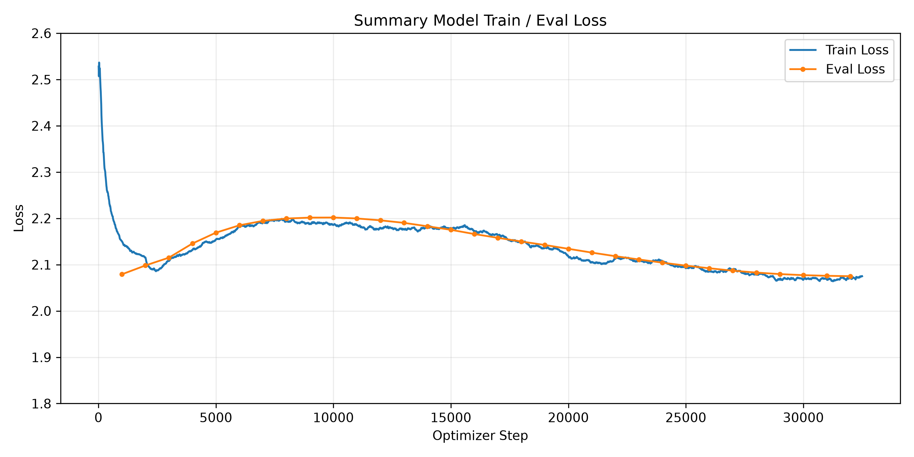

# Ko-LLM

Korean-focused language model pretraining and summary fine-tuning codebase.

This repository contains the model architecture, tokenizer-related files, pretraining script, summary supervised fine-tuning script, evaluation script, and utility scripts for Korean language model experiments.

The project builds a decoder-only autoregressive language model and extends it to a Korean document summarization model through supervised fine-tuning.

The original training datasets and full model checkpoints are not included in this repository due to storage and licensing constraints.

---
## Model Overview
| Item | Setting |
|---|---|
| Architecture | Decoder-only Transformer |
| Parameters | 1.2B |
| Layers | 24 |
| Hidden Size | 2,048 |
| FFN Intermediate Size | 5,632 |
| Attention Heads | 16 |
| Key/Value Heads | 4 (GQA) |
| Context Length | 4,096 tokens |
| Vocabulary Size | 64,000 |
---
## Initial Setup

### Installation

Create a Python virtual environment and install the required packages.

```bash
# 1. Create a conda virtual environment
conda create -n ko-llm python=3.11 -y
conda activate ko-llm

# 2. Install required Python packages
python -m pip install -r requirements.txt
```
---

## Project Structure

```text
ko-llm/
├── README.md
├── requirements.txt
├── .gitignore
│
├── base_model.py
├── project_paths.py
│
├── tokenizer_bpe_64k/
│   ├── merges.txt
│   ├── tokenizer.json
│   ├── tokenizer_config.json
│   └── vocab.json
│
└── scripts/
    ├── data/
    │   ├── build_tokenizer_train_data.py
    │   └── build_packed_dataset.py
    │
    ├── tokenizer/
    │   ├── build_tokenizer.py
    │   ├── evaluate_tokenizer.py
    │   └── create_tokenizer_test_split.py
    │
    ├── train/
    │   ├── train_base_model.py
    │   └── train_summary_model.py
    │
    ├── eval/
    │   ├── eval_base_model.py
    │   └── eval_summary_model.py
    │
    └── plot/
        ├── plot_base_loss.py
        └── plot_summary_loss.py
```

---
## Training Environment

The model was trained on a single NVIDIA GPU server.

| Item                | Setting                    |
|---------------------|--------------------------|
| GPU                 | NVIDIA H200 | 
| GPU Memory          | 143,771 MiB                  |
| Number of GPUs Used | 1             | 
| Framework           | PyTorch 2.12.0+cu130                  |
| CUDA      | 13.0                |
| Precision           | bf16                  |

---

## Dataset Overview

This project uses separate datasets for 1) tokenizer training, 2) base model pretraining, and 3) summary supervised fine-tuning (SFT).
### 1) Tokenizer Training Corpus
- The tokenizer was trained using approximately 5GB of text data with a Korean-centered language distribution.

| Data Type       | Size                     | Ratio   |
|-----------------------|--------------------------|---------|
| Korean                | 3.0GB | 60%     |
| English               | 1.5GB                     | 30%     |
| Code                  | 0.5GB                      | 10%     |
| **Total**          | **5.0GB**                  | **100%** |


### 2) Base Model Pretraining Corpus

- The base model was pretrained using a mixed corpus consisting mainly of Korean and English text, with a small amount of code data.

| Data Type       | Size                     | Ratio   |
|-----------------------|--------------------------|---------|
| Korean                | 10.75GB | 68.40%    |
| English               | 4.96GB                     | 31.56%     |
| Code                  | 6.95MB (~0.007GB)                    | 0.04%     |
| **Total**          | **15.72GB**                   | **100%** |

- After tokenization, the raw corpus was packed into fixed-length token blocks for causal language model pretraining.

| Item      | Value                     |
|-----------------------|--------------------------|
| Sequence length                | 4,096 |
| Packed training tokens               | 5.37B tokens                    |

### 3) Summary SFT Corpus

- For supervised fine-tuning, this project uses Korean document-summary pairs for abstractive summarization.

| Item | Value                    | 
|-----------------|--------------------------|
| Type            | Korean document summarization |
| Size            | 2.6GB                     | 
| Task format           | Prompt-response summarization                     | 
| Training samples           | 260,031                  |


- Each JSONL sample should contain at least:

```json
{
  "prompt": "input text",
  "response": "target summary"
}
```

---

## Train Base Model

Run base model pretraining from the project root:

```bash
PYTHONPATH=. python3 scripts/train/train_base_model.py
```

Main training settings, such as sequence length, batch size, gradient accumulation, learning rate, evaluation interval, and checkpoint interval, are defined at the top of `scripts/train/train_base_model.py`.

The script expects packed pretraining data under the local dataset directory defined in `project_paths.py`.

To train from scratch:
```python
RESUME_CHECKPOINT = None
```

To resume from a previous checkpoint:

```python
RESUME_CHECKPOINT = OUTPUT_DIR / "checkpoints" / "step_XXXXX"
```

---

## Train Summary SFT Model

Run summary supervised fine-tuning from the project root:

```bash
PYTHONPATH=. python3 scripts/train/train_summary_model.py
```

Before running, check the base checkpoint path and summary dataset paths at the top of `scripts/train/train_summary_model.py`.

```python
BASE_CHECKPOINT_DIR = Path("...")
TRAIN_JSONL = SUMMARY_TRAIN_JSONL
VALID_JSONL = SUMMARY_VALID_JSONL
OUTPUT_DIR = OUTPUT_ROOT / "summary_model"
```

The SFT script loads a base model checkpoint and fine-tunes the model using summary instruction-response pairs.

---

## Evaluate Summary Model

Run summary model evaluation from the project root:

```bash
PYTHONPATH=. python3 scripts/eval/eval_summary_model.py
```

Before running, check the checkpoint path, test data path, and output directory at the top of `scripts/eval/eval_summary_model.py`.

```python
CHECKPOINT_DIR = OUTPUT_ROOT / "summary_model" / "checkpoints" / "step_XXXXX"
TEST_JSONL = DATA_ROOT / "test_sample.jsonl"
OUTPUT_DIR = OUTPUT_ROOT / "summary_model_eval" / CHECKPOINT_STEP

MAX_NEW_TOKENS = 128
TEMPERATURE = 0.0
MAX_ROUGE_SAMPLES = None
ROUGE_TOKENIZER = "char"
```

The evaluation script calculates loss, perplexity, and ROUGE scores.

---

## Outputs

Training and evaluation results are saved under `outputs/`.

Example output structure:

```text
outputs/
├── base_model/
│   ├── logs/
│   │   └── train_log.csv
│   └── checkpoints/
│       └── step_XXXXX/
│           ├── pytorch_model.pt
│           ├── optimizer.pt
│           ├── scheduler.pt
│           └── training_config.json
│
├── summary_model/
│   └── checkpoints/
│       └── step_XXXXX/
│
└── summary_model_eval/
    └── step_XXXXX/
        ├── summary_eval_results.json
        └── summary_predictions.jsonl
```

---

## Training & Evaluation Summary
The model was evaluated using selected checkpoints from base pretraining and summary supervised fine-tuning.

| Stage     | Checkpoint                     | Evaluation Loss   | Perplexity   | ROUGE-1   | ROUGE-2 | ROUGE-L   |
|-----------------------|--------------------------|---------| ---------| ---------|---------|---------|
| Base Pretraining              | step 144000 | 3.2576    | 25.99    | -    | -       | -   |
| Summary SFT               | step 32503                   | 2.0279   | 7.60    | 0.5409  | 0.3598  | 0.4052  |
### Loss Curves
- Base Model



- Summary Model



---

## Sample Output

**Input document excerpt**
```text
삼도 1동 전농로, 애월읍 장전리 일대에서 진행 예정 2019 제주 왕벚꽃축제가 오는 29일(금)부터 31일(일)까지 제주대학교 입구, 삼성혈, 서귀포 시 표선면 가시리 녹산로·예래동·위미리 일주도로를 비롯한 쟁쟁한 벚꽃 명소 중에서도 제주시 전농로와 장전리에서 개최된다. 올해로 28회를 맞이하는 제주 왕벚꽃축제는 '왕벚꽃 자생지, 제주에서 펼치는 새봄의 향연' 이라는 주제로 펼쳐질 예정이다. 올해 벚꽃은 20일 개화를 시작하여 일주일 후인 27일 절정을 이룰 것으로 예보되어 축제 기간 동안 벚꽃이 만발한 절경을 만끽할  수 있을 것으로 보인다. 이에 애월읍 장전리 일대에서는 각종 공연과 다채로운 체험 프로그램, 플리마켓, 먹거리 장터 등이 운영되고 거리에 야간 조명을 설치하여 분홍빛 경관을 선보일 예정이라고 전했다. 또 따로 포토존을 마련하여 제주에서의 벚꽃 가득 한 추억을 사진으로 담아갈 수 있게 한다. 또 삼도1동 전농로 일원에서도 다양한 행사를 진행하며 새봄의 재미와 즐거움을 더해 줄 것으로 보인다. 더불어 축제 기간 동안 도보로 축제를 방문하는 관광객과 도민들을 위하여 도로 일부 구간(전농로 사거리-남 성로터리)이 차없는 거리로 운영된다. 제주시 관계자는 \"그간 축제기간을 분산개최 하는 것에서 단일화한만큼 효율적인 축제 운영과 관람객 만족도 향상에도 도움이 될 것으로 기대된다\"고 전했다. 이와 더불어 31일에는 삼도1동주민센터 3층 회의실에서 왕벚꽃 축제 발전방안 포럼이 예정되어 있어 지역주민들과 함께 왕벚꽃축제발전방안에 대해 함께 논의할 계획이다. 공식 개막행사 는 30일 오후 7시 애월읍 장전리 특설무대에서 열린다.
```
**Generated Summary**
```text
오는 29일부터 31일까지 제주시 전농로와 장전리에서 열리는 2019 제주 왕벚꽃축제는 '왕벚꽃 자생지, 제주에서 펼치는 새봄의 향연'이라는 주제로 진행될 예정이며, 축제 기간 동안 벚꽃이 만발한 절경을 만끽할 수 있을 것으로 보인다.
```
**Reference Summary**
```text
올해로 28회를 맞이하는 2019 제주 왕벚꽃축제가 오는 29일(금)부터 31일(일)까지 '왕벚꽃 자생지, 제주에서 펼치는 새봄의 향연'이라는 주제로 전농로와 장전리 일대에서 펼쳐질 예정이며 공식 개막행사는 30일 오후 7시 애월읍 장전리 특설무대에서 열린다.
```

More qualitative examples are available in [`examples/summary_predictions_sample.jsonl`](examples/summary_predictions_sample.jsonl).